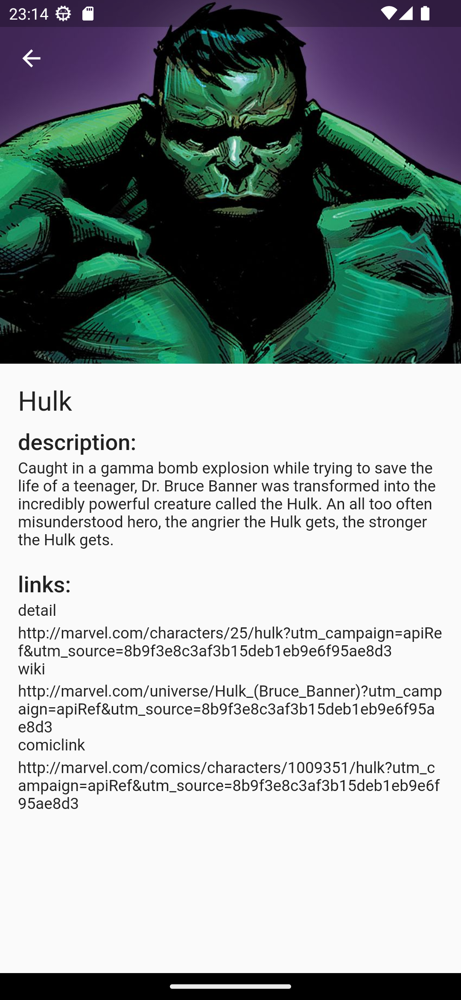

# Marvel Catalog App

App em Flutter usando Clean Architecture, que mostra um catálogo de super-heróis da Marvel provenientes da Marvel API disponível em: https://developer.marvel.com/docs, projeto desenvolvido com o objetivo de estudar e aplicar alguns conceitos de desenvolvimento de software; 

## Plataformas
Android e iOS

## Funcionalidades

Algumas features mapeadas para futuras implementações e acompanhamento do desenvolvimento.

### básicas
- [x] Carrossel superior com 5 personagens
- [x] Uma lista vertical abaixo do carrossel com os personagens seguintes, sem repetir
- [x] Scroll infinito

### features
- [x] Refresh
- [x] Configurações de projeto e ambiente
- [x] Tratamento de erro de conexão
- [x] Tratamento de erros de serviço
- [x] Detalhes dos personagens
- [ ] Campo de busca
- [ ] Filtros
- [ ] Dark/Light Theme

## Como rodar esse projeto?

- Crie no diretório principal um arquivo com o nome `.env`, adicionando as chaves da API exemplificadas no arquivo `.env.example`;

- Execute no terminal o comando `tools/setup.sh`, que será responsável pelo download das libs e geração de alguns arquivos necessários para a execução do projeto;

- Vá até a opção "Run & Debug" do VSCode e execute `marvel_catalog` em ambiente de desenvolvimento ou produção (como utilizaremos as mesmas credenciais para os dois ambientes a única diferença está na exibição ou não do `debugBanner`)

## Observações

- Algumas imagens da interface durante algumas etapas de desenvolvimento podem ser encontradas na pasta `assets/app_images` em `v1`, `v2`, etc... 

## Screenshots

  
   
  
  

  
   

